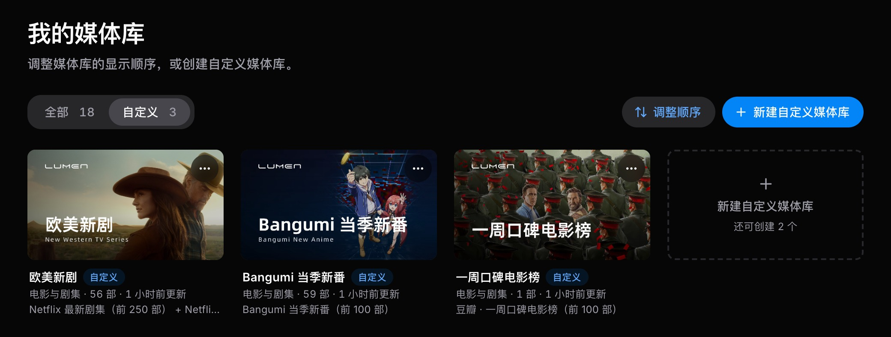
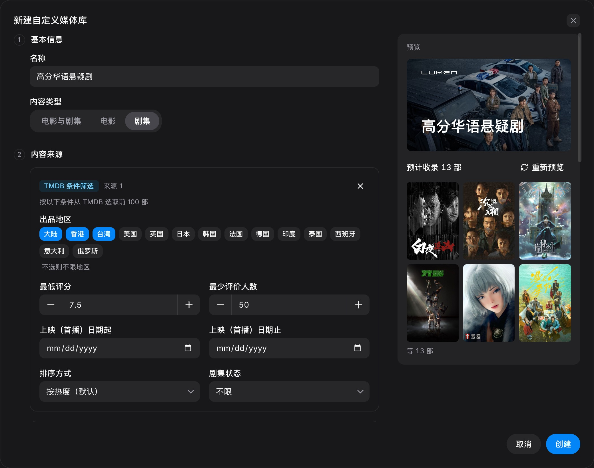

import { Aside, Steps } from '@astrojs/starlight/components';

控制台侧栏中的 **[我的媒体库](https://www.lumen.ax/dashboard/virtual-libraries)** 提供两项功能：

- **调整顺序**：设置客户端中各媒体库的排列顺序
- **自定义媒体库**：按条件或榜单，从片库中自动筛选出一个专属于您的媒体库

两项设置均在服务器端生效，**所有客户端和网页「在线观影」会同步生效**，无需在每个客户端中分别设置。

## 调整媒体库顺序

<Steps>

1. 点击 **调整顺序**。

2. 拖动封面，按您需要的顺序排列，更改会自动保存。

3. 点击 **完成**。如需恢复默认排列，请点击 **恢复默认**。

</Steps>

Infuse、VidHub 等客户端在下次刷新后即会按新顺序显示。

## 自定义媒体库

自定义媒体库会按您设定的条件，从片库中自动挑选影片，并像普通媒体库一样出现在所有客户端中。片库新增了符合条件的影片后，媒体库会按设定的频率自动更新。

- 仅收录片库中已有的影片；榜单上尚未入库的影片不会出现，如需观看可前往[求片](/panel/feedback/)
- 每个账号最多可创建 **5 个**自定义媒体库，每个媒体库最多可添加 6 个内容来源

### 创建媒体库

<Steps>

1. 点击 **新建自定义媒体库**，填写名称并选择内容类型（电影与剧集 / 电影 / 剧集）。

2. 添加内容来源。来源分为三类：
   - **榜单**：豆瓣、TMDB、Bangumi、IMDb 等榜单，以及本站热门
   - **库内筛选**：按类型、人物、标签、出品方、年份、评分从片库中筛选
   - **TMDB 条件筛选**：按出品地区、评分、评价人数等条件筛选

3. 点击 **预览** 查看将收录的影片，确认无误后点击 **创建**。

</Steps>

创建后，客户端刷新即可看到新媒体库。添加多个来源、排除部分内容等进阶设置，可参考下方的示例。

<Aside type="tip" title="榜单首次加载较慢">
	首次使用某个榜单时，需要将榜单与片库逐条匹配，预览可能需要等待一段时间，之后的加载会更快。
</Aside>

### 快速示例

只需一个来源即可完成的常见媒体库：

| 媒体库 | 设置方法 |
| --- | --- |
| **豆瓣 Top250** | 来源选择「榜单」，选择「豆瓣电影 Top250」 |
| **本季新番** | 来源选择「榜单」，选择「Bangumi 当季新番」 |
| **本站热门** | 来源选择「榜单」，在「本站」分组中选择「本月热门」 |
| **高分韩剧** | 内容类型选择「剧集」；来源选择「TMDB 条件筛选」，出品地区选择「韩国」，最低评分填写 8 |

### 进阶示例

#### 周星驰作品

收录片库中周星驰参演或执导的全部电影，并在封面上显示英文名。

| 设置项 | 填写内容 |
| --- | --- |
| 名称 | 周星驰作品 |
| 内容类型 | 电影 |
| 内容来源 | 库内筛选：在「人物」中搜索并添加「周星驰」 |
| 封面副标题 | Stephen Chow |

#### 高分华语悬疑剧

从 TMDB 评分较高的华语剧集中，只保留类型为悬疑的作品。这里使用两个来源，并取它们的**交集**。

| 设置项 | 填写内容 |
| --- | --- |
| 名称 | 高分华语悬疑剧 |
| 内容类型 | 剧集 |
| 来源 1 | TMDB 条件筛选：出品地区选择「大陆」「香港」「台湾」，最低评分填写 7.5，最少评价人数填写 50 |
| 来源 2 | 库内筛选：在「类型」中添加「悬疑」 |
| 多个来源如何组合 | 只收录共同影片 |

在「多个来源如何组合」中选择「只收录共同影片」：

只有同时符合两个来源的剧集才会被收录，即评分达标**且**类型为悬疑的华语剧集。窗口右侧的预览会实时显示预计收录的数量与部分影片，确认无误后再点击 **创建**。

#### 流媒体平台新剧

汇总多个流媒体平台的最新剧集。这里使用四个来源，并取它们的**并集**。

| 设置项 | 填写内容 |
| --- | --- |
| 名称 | 平台新剧 |
| 内容类型 | 剧集 |
| 来源 1–4 | 榜单：分别选择「Netflix 最新剧集」「HBO 最新剧集」「Disney+ 最新剧集」「Prime Video 最新剧集」 |
| 多个来源如何组合 | 全部收录 |
| 更新频率 | 每 6 小时 |

出现在任一平台榜单中的剧集都会被收录；榜单更新后，媒体库会随之自动更新。

#### 合家欢动画

收录评分较高的动画与家庭影片，并排除不适合全家观看的类型。

| 设置项 | 填写内容 |
| --- | --- |
| 名称 | 合家欢 |
| 内容类型 | 电影 |
| 内容来源 | 库内筛选：在「类型」中添加「动画」和「家庭」，最低评分填写 7 |
| 排除类型 | 恐怖 |

同一条件中填写多项时，满足其中之一即可收录，因此类型为动画**或**家庭的影片都会被收录；属于「排除类型」的影片不会被收录（手动添加的影片除外）。

#### 个人片单

不设置任何来源，只收录您亲自挑选的影片，适合整理「想看清单」或专题片单。

| 设置项 | 填写内容 |
| --- | --- |
| 名称 | 想看清单 |
| 内容来源 | 不添加 |
| 手动添加 | 搜索片库，逐部加入想看的影片 |

之后在[在线观影](/watch/web/)中浏览时，也可以随时通过详情页将影片加入该片单，详见下文。

### 从详情页加入

在[在线观影](/watch/web/)中打开任意一部影片，点击详情页上的 **加入自定义媒体库**，即可将该影片直接加入您的某个媒体库。

### 管理媒体库

点击媒体库封面右上角的菜单，可以 **编辑**、**立即更新**、**更换封面**、**停用**或**删除**该媒体库。删除媒体库不会影响片库中的影片。
