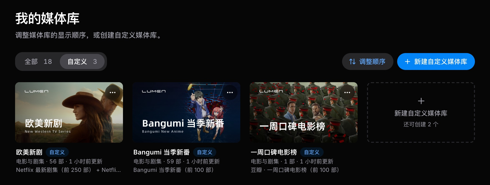

import { Aside, Steps } from '@astrojs/starlight/components';

控制台侧栏中的 **[我的媒体库](https://www.lumen.ax/dashboard/virtual-libraries)** 提供两项功能：

- **排序与隐藏**：设置客户端中各媒体库的排列顺序，隐藏不需要的媒体库
- **自定义媒体库**：按条件或榜单，从片库中自动筛选出一个专属于您的媒体库

两项设置均在服务器端生效，**所有客户端和网页「在线观影」会同步生效**，无需在每个客户端中分别设置。

## 排序与隐藏

<Steps>

1. 点击 **排序与隐藏**。

2. 拖动封面，按您需要的顺序排列；点击封面左上角的眼睛图标，可隐藏或重新显示该媒体库。更改会自动保存。

3. 点击 **完成**。如需恢复默认排列，请点击 **恢复默认顺序**。

</Steps>

Infuse、VidHub 等客户端在下次刷新后即会按新设置显示。

隐藏的媒体库不会出现在客户端和网页「在线观影」的媒体库列表中，库中的影片仍可正常搜索和播放。隐藏的媒体库列在页面下方的 **已隐藏** 中，点击封面右上角的眼睛图标即可恢复显示。

## 自定义媒体库

自定义媒体库会按您设定的条件，从片库中自动挑选影片，并像普通媒体库一样出现在所有客户端中。片库新增了符合条件的影片后，媒体库会自动更新；使用榜单时，榜单内容按您设定的频率更新。

- 仅收录片库中已有的影片；榜单上尚未入库的影片不会出现，如需观看可前往[求片与反馈](/panel/feedback/)提交求片
- 每个账号可创建的自定义媒体库数量有上限（默认 5 个），页面上会显示还可创建的数量；每个媒体库可使用的榜单与筛选条件数量也有上限，以页面提示为准

### 创建媒体库

<Steps>

1. 点击 **新建自定义媒体库**，填写名称并选择内容类型（电影与剧集 / 电影 / 剧集）。

2. 在「媒体库」中选择筛选范围：默认为全部媒体库，也可以只选择其中几个。

3. 在「筛选条件」中点击 **添加条件**，逐条设置。可用的条件包括：
   - **榜单**：豆瓣、TMDB、Bangumi、巴哈姆特、IMDb 等榜单，以及本站热门
   - **影片信息**：类型、主题、出品地区、语言、人物、出品公司、上映（首播）时间、TMDB 评分、评分人数、分级等

4. 如有需要，在「手动调整」中指定 **始终包含** 或 **始终排除** 的影片。

5. 窗口右侧的预览会显示预计收录的数量与部分影片，确认无误后点击 **创建**。

</Steps>

创建后，客户端刷新即可看到新媒体库。

<Aside type="tip" title="榜单首次加载较慢">
	首次使用某个榜单时，需要将榜单与片库逐条匹配，预览可能需要等待一段时间，之后的加载会更快。
</Aside>

### 条件如何组合

- **多个条件需同时满足**。例如「出品地区包含韩国」与「TMDB 评分不低于 8」两个条件，只收录同时符合的影片
- **同一条件中填写多项时，满足其中之一即可**。例如类型同时填写「动画」和「家庭」，或在一个榜单条件中添加多个榜单
- 每个条件可切换比较方式，例如「包含 / 不包含」「在 / 不在」「不低于 / 不高于」
- 需要「满足其中一组即可」时，点击 **添加条件组**：组内的条件需同时满足，符合任一组的影片都会被收录
- 「始终包含」的影片不受媒体库范围与筛选条件限制；「始终排除」优先于其他所有设置

### 快速示例

只需一两个条件即可完成的常见媒体库：

| 媒体库 | 设置方法 |
| --- | --- |
| **豆瓣 Top250** | 内容类型选择「电影」；添加「榜单」条件，选择「豆瓣电影 Top250」 |
| **本季新番** | 添加「榜单」条件，选择「Bangumi 当季新番」 |
| **本站热门** | 添加「榜单」条件，在「本站」分组中选择「本月热门」 |
| **高分韩剧** | 内容类型选择「剧集」；添加「出品地区」条件，选择「韩国」；再添加「TMDB 评分」条件，填写不低于 8 |

### 进阶示例

#### 周星驰作品

收录片库中周星驰参演或执导的全部电影，并在封面上显示英文名。

| 设置项 | 填写内容 |
| --- | --- |
| 名称 | 周星驰作品 |
| 内容类型 | 电影 |
| 筛选条件 | 「人物」包含「周星驰」 |
| 封面副标题 | Stephen Chow |

#### 高分华语悬疑剧

收录评分较高的华语悬疑剧集。这里添加四个条件，影片需**同时满足**。

| 设置项 | 填写内容 |
| --- | --- |
| 名称 | 高分华语悬疑剧 |
| 内容类型 | 剧集 |
| 条件 1 | 「出品地区」包含「中国大陆」「中国香港」「中国台湾」 |
| 条件 2 | 「类型」包含「悬疑」 |
| 条件 3 | 「TMDB 评分」不低于 7.5 |
| 条件 4 | 「评分人数」不低于 50 |

出品地区中填写了三项，属于其中任一地区即可；四个条件之间则需同时满足。窗口右侧的预览会逐步显示每个条件筛选后的数量。

#### 流媒体平台新剧

汇总多个流媒体平台的最新剧集。这里只用一个榜单条件，在其中添加四个榜单。

| 设置项 | 填写内容 |
| --- | --- |
| 名称 | 平台新剧 |
| 内容类型 | 剧集 |
| 筛选条件 | 「榜单」：依次添加「Netflix 最新剧集」「HBO 最新剧集」「Disney+ 最新剧集」「Prime Video 最新剧集」 |
| 榜单更新频率 | 每 6 小时 |

出现在任一榜单中的剧集都会被收录；榜单更新后，媒体库会随之自动更新。

#### 合家欢动画

收录评分较高的动画与家庭影片，并排除不适合全家观看的类型。

| 设置项 | 填写内容 |
| --- | --- |
| 名称 | 合家欢 |
| 内容类型 | 电影 |
| 条件 1 | 「类型」包含「动画」「家庭」 |
| 条件 2 | 「TMDB 评分」不低于 7 |
| 条件 3 | 「类型」不包含「恐怖」 |

类型为动画**或**家庭的影片都会被收录，其中类型含恐怖的影片会被排除。

#### 本季追番

同时收录当季新番榜上的动画，以及仍在连载的日本剧集。这里使用两个**条件组**，符合任一组即可。

| 设置项 | 填写内容 |
| --- | --- |
| 名称 | 本季追番 |
| 内容类型 | 剧集 |
| 条件组 1 | 「榜单」在「Bangumi 当季新番」 |
| 条件组 2 | 「出品地区」包含「日本」；「播出状态」选择「连载中」 |

#### 个人片单

不设置筛选条件，只收录您亲自挑选的影片，适合整理「想看清单」或专题片单。

| 设置项 | 填写内容 |
| --- | --- |
| 名称 | 想看清单 |
| 筛选条件 | 不添加 |
| 手动调整 | 在「始终包含」中搜索片库，逐部加入想看的影片 |

之后在[在线观影](/watch/web/)中浏览时，也可以随时通过详情页将影片加入该片单，详见下文。

### 从详情页加入

在[在线观影](/watch/web/)中打开任意一部影片，点击详情页上的 **加入自定义媒体库**，即可将该影片直接加入您的某个媒体库。

### 管理媒体库

点击媒体库封面右上角的菜单，可以 **编辑**、**立即更新**、**更换封面**、**隐藏**或**删除**该媒体库。删除媒体库不会影响片库中的影片。
